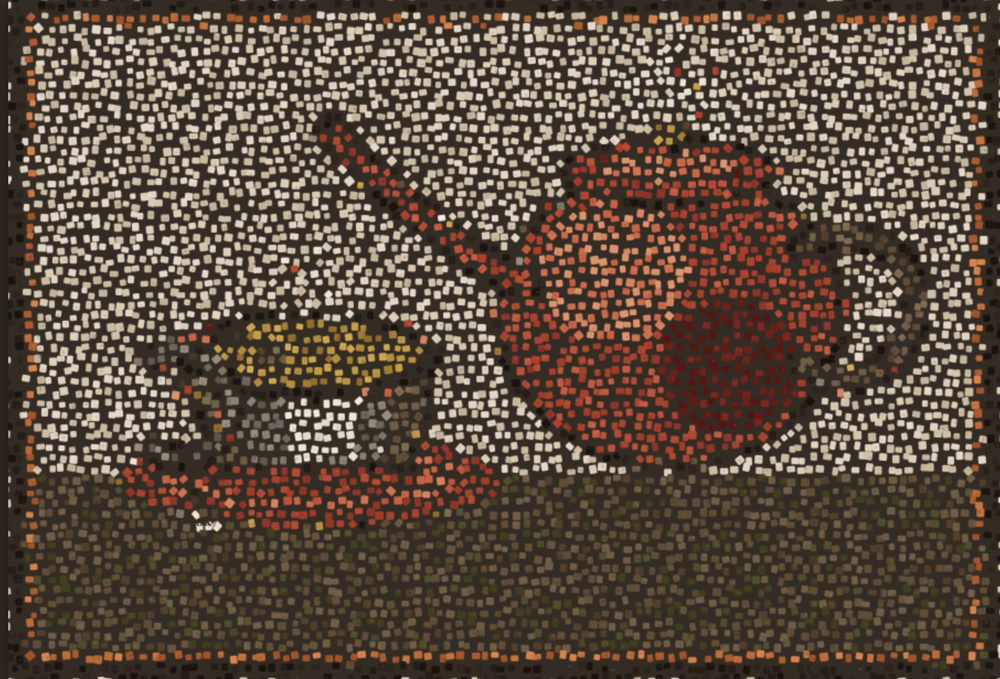

<p align="center">
  
</p>

# TEE: Tessera Embeddings Explorer

**Alpha 3.7.1** | [Documentation](docs/index.md) | [Docker Hub](https://hub.docker.com/r/sk818/tee) | [User Guide](public/user_guide.md)

A system for downloading, processing, and visualizing Sentinel-2 satellite embeddings (2018-2025) with an interactive web interface.

**Privacy by design:** Ground-truth labels and evaluation results never leave your machine. All ML evaluation runs locally or on a compute server you control — never on the hosted server. Similarity searches run entirely in your browser.

## Overview

TEE integrates geospatial data processing with deep learning embeddings to create an interactive exploration platform. The system:

- **Downloads** Tessera embeddings from GeoTessera for multiple years
- **Processes** embeddings into RGB visualizations and pyramid tile structures
- **Extracts** vectors for efficient similarity search
- **Visualizes** embeddings through an interactive web-based viewer
- **Enables** temporal analysis by switching between years
- **Evaluates** classifiers on your own machine with private ground-truth data


## Features

### Multi-Year Support
- Download embeddings for years 2018-2025 (depending on data availability)
- Select which years to process during viewport creation
- Switch between years instantly in the viewer
- Temporal coherence in similarity search through year-specific vector data

### Interactive Viewer
- Zoomable, pannable map interface using Leaflet.js
- Real-time embedding visualization with year selector
- Pixel-level extraction of embeddings
- Similarity search to find matching locations across the viewport

### Viewport Management
- Create custom geographic viewports interactively
- **Landmark/geocode search** — type a place name (e.g. "London") to jump the map and auto-fill the viewport name
- **Direct coordinate input** — enter lat/long coordinates (e.g. "51.5074, -0.1278")
- **Click-to-lock preview box** — 5km box follows the mouse, locks on click, repositionable
- Multi-year processing with progress tracking
- Automatic navigation to viewer after processing
- **Full cleanup on cancel/delete** — removes mosaics, pyramids, vectors, and cached embeddings tiles; shared tiles used by other viewports are preserved

### Explorer Mode (Client-Side Search)
- Click pixels on the embedding map to extract embeddings
- **All similarity search runs locally in the browser** — no queries sent to server
- Vector data (embeddings + coordinates) downloaded once and cached in IndexedDB
- Brute-force L2 search over ~250K vectors completes in ~100-200ms
- Real-time threshold slider for instant local filtering
- Labels and search are fully private — only tile images are fetched from the server

### Manual Labelling
- **Pin labels** — Ctrl+click (or double-click) to place point labels on the map with the active class name and color
- **Polygon labels** — Ctrl+double-click to draw polygon boundaries; interiors are rasterized at 10m resolution
- **Similarity expansion** — each pin/polygon captures an embedding; adjust the per-class similarity slider to expand coverage to nearby pixels in embedding space
- **Classification** — click Classify to generate a full-viewport nearest-centroid classification in Panel 5, respecting per-class thresholds
- **Panel 4 integration** — manual label classes are colored in the PCA/UMAP scatter plot for visual verification
- **Schema support** — load a classification scheme (UKHab v2, HOTW, or custom JSON/text) for standardized class names and codes
- **Label sharing** — contribute labels to the Tessera global habitat directory (private, embedding-only) or share geolocated labels with other users on the same server (public, ESRI Shapefile)
- **Timeline** — track how each manual label class's coverage changes across years

### Segmentation (K-Means Clustering)
- **Auto-cluster** the viewport into k groups using K-means on the embedding space — runs entirely in a Web Worker
- Segmentation results appear as a **temporary preview** overlay with a floating panel
- **Promote** individual clusters (or all at once) to permanent saved labels with full metadata (embedding, source pixel, threshold)
- Promoted labels support timeline analysis, cross-viewport re-matching, and all other label features

### Validation (Learning Curves)
- Upload one or more ground-truth shapefiles (.zip) — multiple uploads are merged automatically
- All classifiers available: k-NN, Random Forest, XGBoost, MLP, Spatial MLP (3×3/5×5), U-Net (GPU)
- Embeddings loaded tile-by-tile from GeoTessera — works at any scale from a single viewport to a country
- Spatial MLP computes per-tile neighbourhood features; U-Net trains on 256×256 patches around labelled regions
- **Regression support**: numeric fields with >20 unique values auto-detected — shows R², RMSE, MAE
- **All ML runs on a compute server** (`tee-compute`) — ground-truth data never leaves your machine
- **Standalone CLI** for headless batch evaluation: `python scripts/tee_evaluate.py --config eval.json`
- Tile data cached between runs — switching classifiers doesn't re-download embeddings
- Results rendered as learning curves with error bars, confusion matrices, and downloadable trained models

### Cross-Year Label Timeline
- **Track how label coverage changes over time** — click "Timeline" on any saved label to see pixel counts across all available years (2018–2025)
- Uses the label's stored embedding and threshold for consistent comparison
- Results displayed in a modal with a proportional **bar chart** (colored with the label's color) and a **percentage change summary** (e.g. "33% decrease from 2019 to 2023")
- Loads each year's vector data from IndexedDB cache (or downloads in background) without disrupting the current session
- All computation stays client-side — label privacy is preserved

### Advanced Viewer (6-Panel Layout)

The viewer includes a **6-panel layout** toggle for advanced analysis:

1. **OSM** — OpenStreetMap geographic reference
2. **RGB** — Satellite imagery with label painting tools
3. **Embeddings Y1** — First year embeddings with similarity search
4. **PCA / UMAP** — Dimensionality reduction of embedding space (PCA computed in-browser, UMAP server-side)
5. **Panel 5** — Change heatmap / classification results / segmentation overlay (mode-dependent)
6. **Panel 6** — Second year embeddings (change-detection mode) or blank (explore mode)

A **Labelling** mode replaces Panel 6 with label management — choose between **Auto-label** (K-means segmentation + promoted labels) and **Manual Label** (hand-placed pins, polygons, and similarity-based expansion with per-class thresholds). A **Validation** mode replaces the bottom row with a controls panel and a learning-curve chart for evaluating classifier performance on uploaded ground-truth shapefiles at any scale, with all classifiers including spatial and U-Net.

Key capabilities: one-click similarity search, real-time threshold control, persistent colored label overlays, cross-panel synchronized markers, manual pin and polygon labelling with classification, UMAP visualization with satellite RGB coloring, temporal distance heatmap, year-based label updates, cross-year label timeline analysis, ground-truth validation with learning curves, large-area k-fold evaluation with regression support, and a standalone CLI for headless batch evaluation.

Labels are stored in browser localStorage (private, survive reloads). Labels can be exported/imported as compact JSON files for sharing — they are portable across viewports since matching uses embedding distance, not coordinates.

### Export Options

A consolidated **Export** dropdown provides four formats:

- **JSON (full)** — compact metadata with embeddings for re-importing into TEE
- **GeoJSON** — FeatureCollection with point and polygon geometries for GIS tools
- **ESRI Shapefile (ZIP)** — standard `.shp/.dbf/.shx/.prj` bundle for ArcGIS, QGIS, etc.
- **Map (JPG)** — high-resolution satellite image with label overlays and legend

## Quick Start

### Prerequisites

- Python 3.8+ (or Docker)
- ~5GB storage per viewport (varies by number of years)

### Option A: Docker Installation (Recommended)

1. **Install Docker Desktop:**
   - Mac: `brew install --cask docker` or download from [docker.com](https://www.docker.com/products/docker-desktop/)
   - Windows/Linux: Download from [docker.com](https://www.docker.com/products/docker-desktop/)

2. **Pull and run from Docker Hub (easiest):**
   ```bash
   docker pull sk818/tee:stable
   docker run -d --name tee --restart unless-stopped \
       -p 8001:8001 -v /data:/data -v /data/viewports:/app/viewports \
       sk818/tee:stable
   ```

   **Management** (users, quotas, updates):
   ```bash
   docker cp tee:/app/scripts/manage.sh ~/manage.sh && chmod +x ~/manage.sh
   sudo ./manage.sh
   ```

   **Or build from source:**
   ```bash
   git clone https://github.com/ucam-eo/TEE.git tee
   cd tee
   docker build -t tee .
   docker run -p 8001:8001 -v ~/tee_data:/data tee
   ```

   **Or with docker-compose:**
   ```bash
   docker-compose up -d
   ```

3. **Open browser:** Navigate to http://localhost:8001

### Option B: Local Installation

1. **Clone the repository:**
   ```bash
   git clone https://github.com/ucam-eo/TEE.git tee
   cd tee
   ```

2. **Create and activate virtual environment:**
   ```bash
   python3 -m venv venv
   source venv/bin/activate  # On Windows: venv\Scripts\activate
   ```

3. **Install dependencies:**
   ```bash
   pip install -r requirements.txt
   ```

4. **Start the server:**
   ```bash
   bash restart.sh
   ```
   Web server on http://localhost:8001 (serves both API and tiles).

5. **Create a viewport:** Open http://localhost:8001, click "+ Create New Viewport", search for a location or click the map, select years, and click Create.

## Deployment

### Local vs Server

| | Local (single machine) | Server (VM behind Apache) |
|---|---|---|
| Setup | `bash restart.sh` | `sudo bash deploy.sh` then `sudo bash restart.sh` |
| User | Your user | `tee` system user |
| Data | `~/data/` | `/home/tee/data/` |
| Logs | `./logs/` | `/var/log/tee/` |
| Binding | `0.0.0.0` (direct access) | `127.0.0.1` (Apache proxies) |
| Tiles | Served on `:8001` (same process) | Apache proxies everything to `:8001` |
| HTTPS | N/A | Apache handles TLS; set `TEE_HTTPS=1` |

`restart.sh` auto-detects the environment: if a `tee` system user exists, services run as `tee` with server settings; otherwise they run as the current user in local mode. No code changes needed between server and laptop.

### Local Development

```bash
bash restart.sh
# Web server on http://localhost:8001 (waitress — serves API, tiles, and static files)
```

Data is stored in `~/data/` by default (override with `TEE_DATA_DIR`). Logs go to `./logs/`.

### Server Deployment (Behind Apache)

**First-time setup:**
```bash
cd /opt
sudo git clone https://github.com/ucam-eo/TEE.git tee
cd /opt/tee
sudo bash deploy.sh          # Creates tee user, venv, data dirs
sudo -u tee /opt/tee/venv/bin/python3 scripts/manage_users.py add admin
sudo bash restart.sh          # Start services
curl http://localhost:8001/health   # Verify
```

**Day-to-day operations:**
```bash
cd /opt/tee
sudo git pull && sudo bash restart.sh   # Update and restart
sudo bash shutdown.sh                    # Stop services
bash status.sh                           # Check status
tail -f /var/log/tee/web_server.log      # View logs
```

The viewer uses relative URLs, so it works identically behind a local or remote server. Configure your reverse proxy to forward all traffic to Django/waitress on port 8001 — API, tiles, and static files are all served from a single process.

## Authentication & User Management

TEE supports optional per-user authentication. When enabled, unauthenticated users can browse in read-only **demo mode** with a **Login** button in the header. Logged-in users see their username, a **Change Password** button, and a **Logout** button.

### Enabling Authentication

Authentication uses Django's built-in auth system. It activates automatically when at least one Django `User` exists. If no users exist, auth is disabled and all users have open access.

### Managing Users (Docker)

Copy the management script out of the container once, then use it to manage everything:

```bash
docker cp tee:/app/scripts/manage.sh ~/manage.sh && chmod +x ~/manage.sh
sudo ./manage.sh
```

This gives an interactive menu:
```
TEE Management
  1) List users
  2) Add user
  3) Remove user
  4) Set quota
  5) Update container
  6) Exit
```

### Disabling Authentication

Remove all users via the management script (option 3). When no Django users exist, auth is automatically disabled and all users have open access.

### The `admin` User

The `admin` user has special privileges:
- **No disk quota** — can create viewports without size limits
- All other users default to a **2 GB disk quota** (configurable per user)

### Disk Quotas

Each non-admin user has a disk quota for viewport data (default 2 GB). Set per-user quotas via the management script (option 4) — accepts values like `4G`, `512M`, or bare MB.

Quotas are configured per user via the management script (option 4).

### Changing Passwords

Logged-in users can change their password via the **Password** button in the header. Passwords must be at least 6 characters.

### HTTPS Session Cookies

When deploying behind HTTPS, set `TEE_HTTPS=1` to mark session cookies as secure:
```bash
export TEE_HTTPS=1
```

## Configuration

### Environment Variables

| Variable | Default | Description |
|----------|---------|-------------|
| `TEE_DATA_DIR` | `~/data` | Data directory (mosaics, pyramids, vectors) |
| `TEE_APP_DIR` | Project root | Application directory (auto-detected from `lib/config.py`) |
| `TEE_MODE` | `desktop` | `desktop` (DEBUG=True) or `production` (DEBUG=False, security headers) |
| `TEE_HTTPS` | unset | Set to `1` to mark session cookies as `Secure` (for HTTPS) |
| `GEOTESSERA_API_KEY` | — | GeoTessera API credentials (if required) |

### Preset Viewports

Modify `viewports/{name}.txt` to customize preset viewports:
```
name: My Viewport
description: Optional description
bounds: 77.55,13.0,77.57,13.02
```

## Data Pipeline

The system processes satellite embeddings through five main stages with **parallel multi-year processing**. All pipeline execution flows through `lib/pipeline.py::PipelineRunner`, providing consistent behavior for both web-based and CLI entry points.

### CLI One-Liner

```bash
./venv/bin/python3 setup_viewport.py --years 2023,2024,2025 --umap-year 2024
```

This runs the full pipeline: download → RGB → pyramids → vectors → UMAP. PCA is computed client-side in the browser (no pipeline stage needed).

Or use the web interface: `bash restart.sh`, open http://localhost:8001, click "+ Create New Viewport", select years and click Create. Processing runs in the background with status tracking.

### Pipeline Stages

Each stage processes **all selected years in parallel**:

#### 1. Download Embeddings
```bash
python3 download_embeddings.py --years 2019,2021,2025
```
- Downloads Sentinel-2 embeddings from GeoTessera (all years concurrently)
- Saves as GeoTIFF files in `~/data/mosaics/`

#### 2. Create RGB Visualizations
```bash
python3 create_rgb_embeddings.py
```
- Converts 128D embeddings to RGB using the first 3 bands
- Outputs to `~/data/mosaics/rgb/`

#### 3. Build Pyramid Structure
```bash
python3 create_pyramids.py
```
- Creates multi-level zoom pyramids (0-5) with 3x nearest-neighbor upscaling
- **Viewer becomes available** once ANY year has pyramids
- Output: `~/data/pyramids/{viewport}/{year}/`

#### 4. Extract Vectors
```bash
python3 extract_vectors.py
```
- Extracts vectors from embeddings for all years
- **Labeling controls become available** once ANY year has vectors
- Output: `~/data/vectors/{viewport}/{year}/`

#### 5. Compute UMAP (Optional)
```bash
python3 compute_umap.py {viewport_name} {year}
```
- Computes 2D UMAP projection (~1-2 min for 264K embeddings)
- Used by the 6-panel layout (Panel 4)
- **UMAP visualization becomes available** once computed
- Output: `~/data/vectors/{viewport}/{year}/umap_coords.npy`

### Incremental Feature Availability

| Stage | Feature | Available When |
|-------|---------|-----------------|
| After Stage 3 (Pyramids) | Basic viewer with maps | ANY year has pyramids |
| After Stage 4 (Vectors) | Labeling/similarity search, PCA (Panel 4) | ANY year has vectors |
| After Stage 5 (UMAP) | UMAP visualization (Panel 4) | UMAP computed for any year |

### Status Tracking

Check pipeline status via:
```bash
curl http://localhost:8001/api/operations/progress/{viewport_name}_pipeline
```

## API Reference

### Viewport Management

**List all viewports:**
```
GET /api/viewports/list
```

**Get current viewport:**
```
GET /api/viewports/current
```

**Switch viewport:**
```
POST /api/viewports/switch
Content-Type: application/json

{"name": "viewport_name"}
```

**Create new viewport:**
```
POST /api/viewports/create
Content-Type: application/json

{
  "bounds": "min_lon,min_lat,max_lon,max_lat",
  "name": "My Viewport",
  "years": ["2021", "2024"]  // Optional: default is [2024]
}
```

**Check viewport readiness:**
```
GET /api/viewports/{viewport_name}/is-ready
```
Returns: `{ready: bool, message: string, has_embeddings: bool, has_pyramids: bool, has_vectors: bool, has_umap: bool, years_available: [string]}`

**Get available years:**
```
GET /api/viewports/{viewport_name}/available-years
```
Returns: `{success: bool, years: [2024, 2023, ...]}`

### Authentication

**Check auth status:**
```
GET /api/auth/status
```
Returns: `{auth_enabled: bool, logged_in: bool, user: string|null}`

**Log in:**
```
POST /api/auth/login
Content-Type: application/json

{"username": "admin", "password": "secret"}
```

**Log out:**
```
POST /api/auth/logout
```

**Change password (requires active session):**
```
POST /api/auth/change-password
Content-Type: application/json

{"current_password": "old", "new_password": "new"}
```

### Evaluation

**Upload ground-truth shapefile:**
```
POST /api/evaluation/upload-shapefile
Content-Type: multipart/form-data

file: <.zip containing .shp/.dbf/.shx/.prj>
```
Returns: `{fields: [{name, unique_count, samples}], geojson: <GeoJSON>}`

**Run learning-curve evaluation:**
```
POST /api/evaluation/run
Content-Type: application/json

{
  "viewport": "cumbria",
  "year": "2024",
  "field": "Group_Name",
  "classifiers": ["nn", "rf", "xgboost", "mlp"],
  "max_train": 10000,
  "params": {
    "nn": {"n_neighbors": 5, "weights": "uniform"},
    "rf": {"n_estimators": 100, "max_depth": null},
    "xgboost": {"n_estimators": 100, "max_depth": 6, "learning_rate": 0.3},
    "mlp": {"hidden_layers": "64,32", "max_iter": 200}
  }
}
```
Returns: `{training_sizes, classifiers: {<name>: {mean_f1, std_f1}}, classes, total_labelled_pixels, elapsed_seconds, models_available}`

**Run large-area evaluation (k-fold CV):**
```
POST /api/evaluation/run-large-area
Content-Type: application/json

{
  "field": "UKHab_L2",
  "year": 2024,
  "classifiers": ["nn", "rf", "mlp"],
  "classifier_params": {},
  "kfold": 5,
  "max_training_samples": 30000,
  "seed": 42
}
```
Returns: NDJSON stream with events: `field_start`, `download_progress`, `start`, `fold_result`, `aggregate`, `confusion_matrices`, `done`

**Download trained model:**
```
GET /api/evaluation/download-model/<classifier>
```
Returns: `.joblib` file containing `{model, class_names}` trained on all labelled data

## Project Structure

```
TEE/
├── README.md                          # This file
├── requirements.txt                   # Python dependencies
├── Dockerfile                         # Docker container definition
├── docker-compose.yml                 # Docker Compose configuration
│
├── deploy.sh                          # First-time VM setup (creates tee user, venv, dirs)
├── restart.sh                         # Start/restart web + tile servers
├── shutdown.sh                        # Stop all servers
├── status.sh                          # Show project status (git, data, services)
│
├── manage.py                          # Django management script
├── tee_project/                       # Django project settings
│   ├── settings/                      # Split settings (base, desktop, production)
│   ├── urls.py                        # Root URL configuration
│   └── wsgi.py                        # WSGI entry point (used by waitress)
│
├── api/                               # Django app — API endpoints
│   ├── middleware.py                   # Auth middleware (Django auth + demo mode)
│   ├── auth_views.py                  # Login/logout/status/change-password
│   ├── tasks.py                       # Background task tracking
│   ├── helpers.py                     # Shared utilities
│   └── views/                         # Endpoint modules
│       ├── viewports.py               # Viewport CRUD and status
│       ├── pipeline.py                # Downloads and processing
│       ├── compute.py                 # UMAP, distance heatmap
│       ├── tiles.py                   # Tile serving with LRU cache and ETag support
│       ├── vector_data.py             # Vector data serving
│       ├── evaluation.py              # Validation: shapefile upload, learning curves
│       └── config.py                  # Health, static files, client config
│
├── public/                            # Web interface
│   ├── viewer.html                    # Embedding viewer (3-panel and 6-panel layouts)
│   ├── viewport_selector.html         # Viewport creation and management
│   ├── login.html                     # Login page
│   └── README.md                      # Frontend documentation
│
├── scripts/                           # Management scripts
│   └── tee_evaluate.py                # Standalone CLI for large-area evaluation
│
├── packages/                          # Reusable Python packages
│   └── tessera-eval/                  # Evaluation library (classifiers, regressors, k-fold CV)
│       └── tessera_eval/
│           ├── classify.py            # Classifier and regressor factories
│           ├── evaluate.py            # Learning curves and k-fold cross-validation
│           ├── data.py                # Data loading (TEE vectors, GeoTessera tiles, shapefile)
│           └── rasterize.py           # Shapefile rasterization
│
├── lib/                               # Python utilities
│   ├── config.py                      # Centralized configuration (paths, env vars)
│   ├── evaluation_engine.py           # Shim to tessera-eval library
│   ├── pipeline.py                    # Unified pipeline orchestration
│   ├── viewport_utils.py              # Viewport file operations
│   ├── viewport_writer.py             # Viewport configuration writer
│   └── progress_tracker.py            # Progress tracking utilities
│
├── viewports/                         # Viewport configurations (user-created, gitignored)
│   └── README.md                      # Viewport directory documentation
│
├── tests/                             # Unit tests
│   ├── test_kfold.py                  # k-fold CV, regression metrics, regressor factory
│   └── test_cli.py                    # CLI config validation and dry-run tests
│
├── validation/                        # Static HTML/JS/Python validation tests
│   ├── test_refactoring_guards.py     # API, function, DOM, and backend guards
│   └── test_viewer_html.py            # Viewer HTML structural validation
│
├── download_embeddings.py             # GeoTessera embedding downloader
├── create_rgb_embeddings.py           # Convert embeddings to RGB
├── create_pyramids.py                 # Build zoom-level pyramid structure
├── extract_vectors.py                 # Extract vectors for similarity search
├── compute_umap.py                    # Compute UMAP projection
└── setup_viewport.py                  # Orchestrate full workflow
```

## Development

### Running with Custom Settings

**Download specific years only:**
```bash
python3 download_embeddings.py --years 2023,2024
```

**Process single viewport:**
Set the active viewport first, then run pipeline scripts.

## Troubleshooting

### Server fails to start
- Check if port 8001 is in use: `lsof -i:8001`
- Check logs: `tail logs/web_server.log` (local) or `tail /var/log/tee/web_server.log` (server)

### Tile server not responding
- If map tiles fail to load, restart the server: `bash restart.sh`

### Disk space not reclaimed after deleting a viewport
- Cancelling or deleting a viewport now automatically cleans up cached embeddings tiles in `~/data/embeddings/`
- Tiles shared with other viewports are preserved
- To manually clear all embeddings caches (when no viewports need them): `rm -rf ~/data/embeddings/global_0.1_degree_representation/`

### No data appears in viewer
- Verify pyramids exist: `ls ~/data/pyramids/{viewport}/{year}/`
- Check vectors: `ls ~/data/vectors/{viewport}/{year}/`
- Re-run `create_pyramids.py` or `extract_vectors.py` as needed

### Slow similarity search
- Check vectors were extracted for the selected year
- Reduce similarity threshold for faster results
- Process fewer years per viewport

### Year doesn't appear in dropdown
- Verify embeddings were downloaded: `ls ~/data/mosaics/*_{year}.tif`
- Confirm pyramids exist for that year
- Check that vectors were extracted

## Performance

**Memory & storage:**
- ~550MB steady state, ~850MB peak during pipeline processing
- ~150-300MB per year per viewport for embeddings; ~500MB-1GB per year for pyramid tiles

**Typical processing times:**

| Stage | Time (per year) | Notes |
|-------|-----------------|-------|
| Download embeddings | 5-15 min | All years download in parallel |
| Create RGB | 2-5 min | All years process in parallel |
| Build pyramids | 5-10 min | All years process in parallel |
| Extract vectors | 5-15 min | All years process in parallel |
| **Total** | **17-45 min** | Same time for 1 year or 8 years |

Multiple years are downloaded and processed concurrently — total time is approximately the same whether you request 1 year or 8 years. Features become available incrementally as each stage completes (see [Incremental Feature Availability](#incremental-feature-availability)).

## License

MIT License - See LICENSE file for details

## Authors

- **S. Keshav** - Primary development and design
- **Claude Opus 4.6** - AI-assisted development and feature implementation

## Related Resources

- [GeoTessera Documentation](https://geotessera.readthedocs.io/)
- [Leaflet.js Map Library](https://leafletjs.com/)
- [Sentinel-2 Satellite Data](https://sentinel.esa.int/web/sentinel/missions/sentinel-2)

## Support

For issues or questions:
1. Check the troubleshooting section
2. Review server logs: `/var/log/tee/web_server.log` (server) or `logs/web_server.log` (local)
3. Verify data files exist in `~/data/`
4. Check browser console for JavaScript errors

## Acknowledgements

Thanks to Julia Jones (Bangor), David Coomes (Cambridge), Anil Madhavapeddy (Cambridge), and Sadiq Jaffer (Cambridge) for their insightful feedback on half-baked versions of the code.

## Citation

If you use this project in research, please cite:

```bibtex
@software{tee2025,
  title={TEE: Tessera Embeddings Explorer},
  author={Keshav, S. and Claude Opus 4.6},
  year={2025},
  url={https://github.com/ucam-eo/TEE}
}
```
