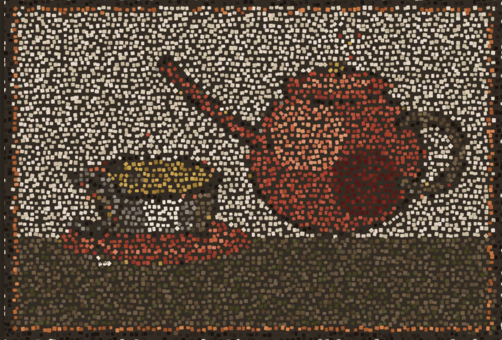
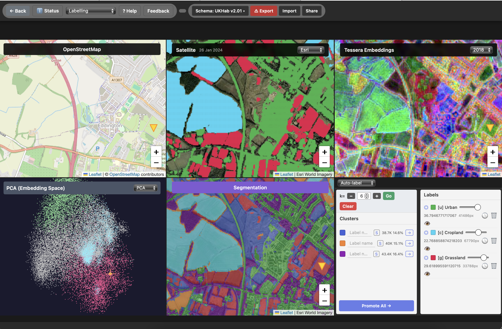

<p align="center">
  
</p>

# TEE: Tessera Embeddings Explorer

**v1.9.0** | [User Guide](public/user_guide.md) | [Docker Hub](https://hub.docker.com/r/sk818/tee)

A web-based tool for exploring and classifying land cover from Sentinel-2 satellite imagery using [Tessera](https://geotessera.org) embeddings.

## What can TEE do?

- **Explore** any 5km x 5km area on Earth using 128-dimensional Tessera embeddings (2018-2025)
- **Find similar pixels** instantly — double-click anywhere to highlight similar locations
- **Label habitats** using K-means clustering (with a settable seed for reproducible clusters), manual pins, polygon drawing, and standard schemas (UKHab, EUNIS, HOTW)
- **Export** hand-drawn or classified pixels as GeoJSON / Shapefile / KML polygons, not just points
- **Evaluate classifiers** (k-NN, Random Forest, XGBoost, MLP, Deep MLP, Spatial MLP, U-Net) for **classification or regression**, with **learning curves** or **k-fold cross-validation**, on ground-truth shapefiles at any scale — with a spatial hold-out, a geographic split for k-fold, a field-grouped split (no within-field leakage), separate train/test years, or a separate held-out test file, all keyed off one random seed, and PNG/CSV export of every panel
- **Generate classification / regression maps** as GeoTIFFs (native UTM, optional value clamping) for use in GIS, with an in-browser preview
- **Compare years** side by side to detect land-use change

> **Privacy by design:** Similarity searches and labelling run entirely in your browser. ML evaluation runs on your own compute server. Ground-truth data never leaves your machine.



## Quick Start

### Hosted version

Open [tee.cl.cam.ac.uk](https://tee.cl.cam.ac.uk) to explore existing viewports without an account. To create your own viewports, ask a TEE enroller for an account.

### Docker (self-hosted)

```bash
docker pull sk818/tee:stable
docker run -d --name tee --restart unless-stopped \
    -p 8001:8001 -v /data:/data -v /data/viewports:/app/viewports \
    sk818/tee:stable
```

Open http://localhost:8001.

### ML Evaluation

Evaluation requires a compute server (`tee-compute`). See the [Compute Server Setup](public/user_guide.md#compute-server-setup) section of the User Guide for full instructions.

```bash
# Everything on your laptop (no GPU server needed)
./scripts/deploy-compute.sh --local

# Or offload ML to a GPU server via SSH tunnel
./scripts/deploy-compute.sh gpu-box
```

Then open http://localhost:8001 and go to Validation > Evaluate.

## Documentation

The **[User Guide](public/user_guide.md)** covers everything:

- Creating and managing viewports (and the "Add Years" flow / no-data years)
- Similarity search and labelling workflows
- Classification schemas (UKHab, EUNIS, HOTW)
- Auto-labelling with K-means, including the clustering seed
- Compute server setup (local, GPU, all-local modes)
- Validation: learning curves, k-fold cross-validation (mechanics and fold selection), confusion matrices, regression metrics and scatter
- Classification vs regression, the task-type override, and one settable random seed
- Classifier parameters and hyperparameter variants; the Deep MLP, Spatial MLP, and U-Net models
- Spatial train/test splits, spatial k-fold, group-by-field splits, separate train/test years, and a separate held-out test file
- PNG / CSV export of the validation panels (hi-res)
- Exporting labels (points or classified-pixel polygons) and generating classification / regression maps, with projection guidance and value clamping
- Sharing labels with other users
- CLI for headless batch evaluation

## Community

Join the TEE discussion channel at [eeg.zulipchat.com](https://eeg.zulipchat.com) for help, feedback, and announcements.

## License

MIT License — see LICENSE file for details.

## Authors

- **S. Keshav** — Primary development and design
- **Claude Opus 4.7** — AI-assisted development

## Acknowledgements

Thanks to Julia Jones (Bangor), David Coomes (Cambridge), Anil Madhavapeddy (Cambridge), and Sadiq Jaffer (Cambridge) for their insightful feedback.

## Citation

```bibtex
@software{tee2025,
  title={TEE: Tessera Embeddings Explorer},
  author={Keshav, S. and Claude Opus 4.7},
  year={2026},
  url={https://github.com/ucam-eo/TEE}
}
```
