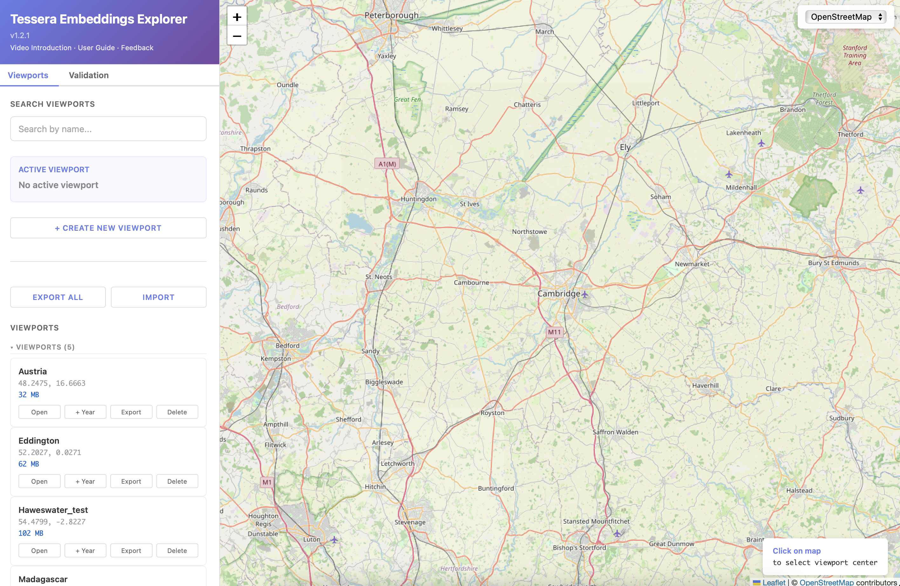
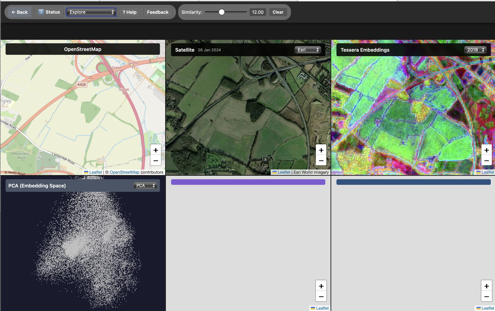
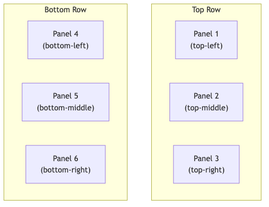
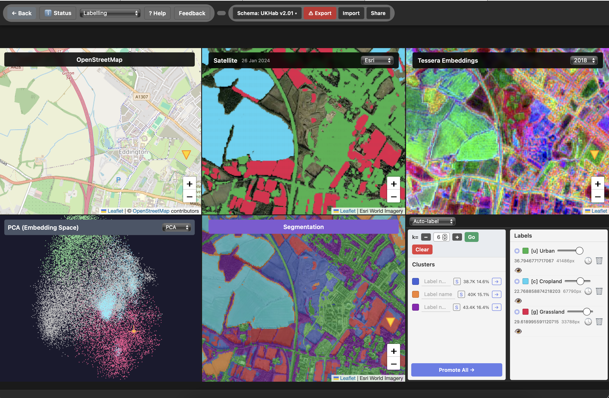
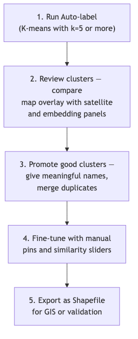
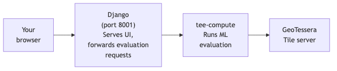
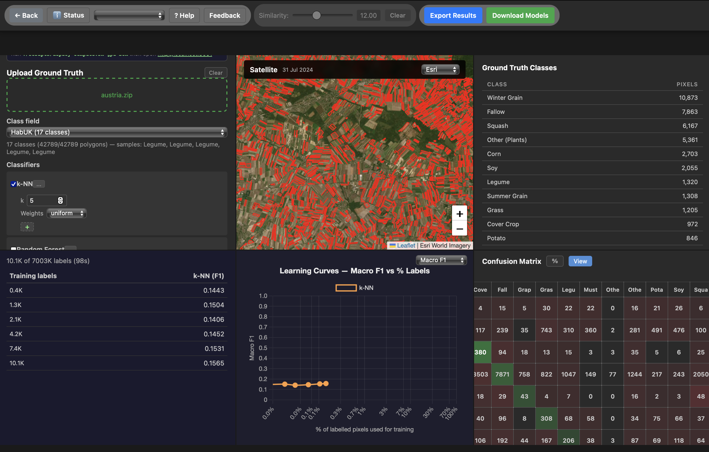
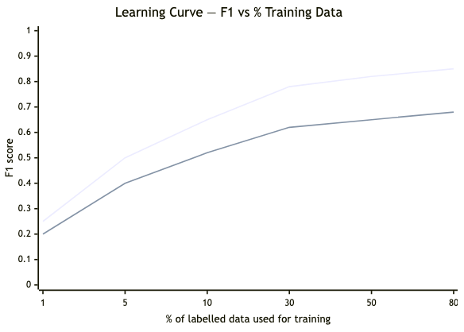

# TEE User Guide

> **Latest version:** This guide is also available on [GitHub](https://github.com/ucam-eo/TEE/blob/main/public/user_guide.md), which may be more up to date than the version bundled with the hosted server.

## What is TEE?

TEE (Tessera Embeddings Explorer) is a web-based tool for exploring and classifying land cover from satellite imagery. It uses **Tessera embeddings** — compact numerical summaries that capture what each 10m × 10m pixel of land "looks like" to a machine learning model trained on Sentinel-2 satellite data. Pixels with similar embeddings tend to be the same type of land cover (grassland, woodland, arable, urban, etc.), even if they are far apart geographically.

With TEE you can:

- **Explore** any 5km × 5km area on Earth, for any year from 2018 to 2025
- **Find similar pixels** instantly — double-click anywhere to highlight all similar locations across your area
- **Label habitats** using automatic clustering, manual pins, or polygon drawing
- **Evaluate classifiers** on your own ground-truth data at any scale — from a single field to an entire country
- **Compare years** side by side to detect land-use change

> **Privacy by design:** Similarity searches and labelling run entirely in your browser — no data is sent to the server. ML evaluation runs on your own machine. Ground-truth shapefiles never leave your computer. The hosted server only serves map tiles and satellite imagery.

---

## Quick Start

### Path 1: Explore a location

1. Open TEE — you'll see the **Viewport Manager** with a map
2. Click **Create New Viewport**, search for a place (or click on the map), choose which years to process, and click **Create**
3. Processing takes a few minutes. When it finishes, click **Open**
4. **Double-click** any pixel on the map — TEE will instantly highlight every similar location in the area, coloured by how similar they are

### Path 2: Label habitats

1. Open a viewport, then switch to **Labelling** mode using the dropdown in the top-left header bar
2. In the bottom-right panel, click **Segment** — TEE will automatically group the pixels into clusters of similar land cover
3. Review the clusters. Give meaningful names to the ones you want to keep (e.g., "Grassland", "Arable"), then click **Promote** to turn them into saved labels
4. Fine-tune by adding manual pins (Ctrl+click on the map) or drawing polygons (Ctrl+double-click to start drawing)
5. Click **Export** to save your labels as a Shapefile you can open in QGIS, or use as ground truth for validation

### Path 3: Evaluate classifiers

1. In the Viewport Manager, go to the **Validation** tab and click **Evaluate**
2. Drag and drop a ground-truth `.zip` shapefile (e.g., habitat survey polygons) onto the upload area
3. Choose a class field (the column in your shapefile that contains the habitat names), select a year, and tick the classifiers you want to test
4. Click **Run Evaluation** — TEE will train each classifier and show you learning curves and a confusion matrix so you can see how well the embeddings distinguish your habitat classes

> **Try it:** The repository includes `austria.zip` — Austrian INVEKOS crop field data (42,789 polygons, 17 crop classes). Upload it, select field **"Crop"**, year **2024**, and click Run.

---

## The Viewport Manager

The **Viewport Manager** is the home page you see when you open TEE. It has two main tabs (plus a Users tab for administrators):

| Tab | Purpose |
|-----|---------|
| **Viewports** | Create, manage, and open viewports |
| **Validation** | Evaluate classifiers on ground-truth shapefiles |
| **Users** | Create and manage user accounts (administrators and enrollers only) |



### Viewports Tab

A **viewport** is a 5km × 5km area of the Earth's surface for which TEE downloads and processes Sentinel-2 satellite embeddings. Think of it as a "study site" — you create one for each area you want to investigate.

The tab shows:

1. **Search** — type to filter your viewports by name
2. **Active viewport** — the viewport you currently have selected
3. **Create New Viewport** — search for a place name or paste coordinates (e.g., `52.2053, 0.1218`), then select which years to process. You can also click directly on the map to choose a location.
4. **Export / Import** — save all your viewports to a file, or restore them from a backup
5. **Viewport list** — grouped by who created them. Your own viewports show all actions (Open, +Year, Export, Delete); other people's viewports show only Open.

> **Note:** Only the person who created a viewport can delete it. Years without satellite coverage for your area are greyed out in the year selector. Check **Private** when creating a viewport to hide it from other users.

### Validation Tab

Click **Evaluate** to open the viewer in validation mode, where you can upload ground-truth shapefiles and test how well different classifiers can distinguish your habitat classes. You will need a compute server running first — see [Compute Server Setup](#compute-server-setup) below.

### Users Tab

Visible to administrators and enrollers. Here you can create new user accounts (with username, email, and password), set disk quotas, and enable or disable users.

---

## The Viewer

When you open a viewport, you enter the **Viewer** — a screen divided into six synchronized panels arranged in a 2×3 grid. All six panels show the same geographic area. When you pan or zoom in one panel, all the others follow.



The header bar at the top lets you switch between different **modes**, each of which shows different information in the six panels:

### Panel Layout by Mode



| Panel | Explore | Change Detection | Labelling | Validation |
|:-----:|---------|-----------------|-----------|------------|
| 1 | OpenStreetMap | OpenStreetMap | OpenStreetMap | **Controls** |
| 2 | Satellite imagery | Satellite imagery | Satellite + labels | Satellite + polygons |
| 3 | Embedding colours | Embeddings (Year 1) | Embedding colours | **Ground Truth classes** |
| 4 | Dimensionality reduction (PCA/UMAP) | Change distribution | Dimensionality reduction | **Progress log** |
| 5 | — | Change heatmap | Classification overlay | **Learning curves** |
| 6 | — | Embeddings (Year 2) | Label management | **Confusion matrix** |

**What are the embedding colour panels?** Each pixel's 128-dimensional embedding is compressed down to 3 numbers and displayed as a colour (red, green, blue). Pixels with similar colours have similar embeddings, which usually means similar land cover. This gives you a quick visual overview of the landscape structure.

**What is dimensionality reduction?** Panel 4 shows PCA or UMAP — two different ways to visualise high-dimensional data in 2D. Each dot represents one pixel, and pixels that are close together in this view have similar embeddings. Clusters of dots often correspond to distinct land cover types.

### Switching Modes

Use the **layout dropdown** in the top-left of the header bar to switch between Explore, Change Detection, and Labelling. Validation mode is accessed from the Viewport Manager's **Validation** tab (not the dropdown).

### Switching Years

Use the **year dropdown** above the embedding panels to change which year's satellite data you're viewing. In Change Detection mode, Year 1 and Year 2 can be set independently to compare any two years.

### Satellite Imagery Source

Use the **satellite source dropdown** in Panel 2 to switch between different imagery providers (Esri World Imagery, Google). The acquisition date of the currently displayed imagery is shown below the dropdown when available — this is useful for understanding what the satellite saw on a specific date.

---

## Similarity Search

This is TEE's core exploration feature, available in **Explore** mode. **Double-click** anywhere on any panel to find every pixel in the viewport that looks similar to the one you clicked. TEE compares the clicked pixel's embedding to all other pixels and highlights the matches — all within your browser, with no data sent to any server.

| Step | What to do |
|------|------------|
| 1 | **Double-click** any pixel on the map |
| 2 | Coloured dots appear across all panels showing similar locations. Adjust the **similarity slider** in the header bar — drag left for stricter matching (fewer, more similar results), drag right for looser matching (more results, less similar). |

This is a quick way to explore what the embeddings "see" at any location. For building up a full set of habitat labels, see [Auto-Labelling](#auto-labelling-k-means-clustering) (which groups pixels into clusters you can review and promote) and [Manual Labelling](#manual-labelling) (which lets you place individual pins and draw polygons).

> **First search takes a moment:** The first time you search in a viewport, TEE downloads the embedding data for all pixels (~20–50MB) and caches it in your browser. After that, all searches are instant.

**Single click** (without double-clicking) places a crosshair marker across all panels — useful for cross-referencing a location between the satellite view, the map, and the embedding panels without triggering a full similarity search.

---

## Labels

A **label** is a named group of pixels that you've identified as belonging to the same land cover type (e.g., "Grassland", "Woodland", "Arable"). Labels are the building blocks for both manual habitat mapping and machine-learning evaluation.

There are three ways to create labels:
- **Auto-labelling** — run K-means clustering, then promote the clusters you want (see [Auto-Labelling](#auto-labelling-k-means-clustering))
- **Manual pins and polygons** — place individual points or draw areas on the map (see [Manual Labelling](#manual-labelling))
- **Import** — load labels from a previously exported JSON or Shapefile

Once you have labels, you can:

| What you can do | How |
|-----------------|-----|
| **Show or hide** a label on the map | Click the eye icon next to the label name |
| **Delete** a label | Click the **trash** icon or **×** next to it |
| **See coverage across years** | Click the **clock icon** next to a label — it shows how many similar pixels exist in each year |
| **Import** labels from a file | Click **Import** and select a JSON, GeoJSON, or ESRI Shapefile (.zip) |
| **Export** labels | Click **Export** — see formats below |

Labels are saved in your browser's local storage, so they persist across page reloads and are tied to the viewport name. However, **local storage is volatile** — it can be cleared by browser updates, clearing browsing data, or switching browsers. Always save your work by exporting regularly. The **Export** button turns red when you have unsaved changes as a reminder.

### Exporting Labels

The export menu offers different formats depending on which mode you're in:

**From Explore / Auto-label modes:**

| Format | What it's for |
|--------|---------------|
| **Labels (JSON)** | Re-import into TEE later |
| **Labels (GeoJSON)** | Open in QGIS or other GIS tools |
| **Map (JPG)** | A screenshot of the satellite view with label overlays — good for presentations |

**From Manual Labelling mode:**

| Format | What it's for |
|--------|---------------|
| **JSON** | Re-import into TEE (includes embeddings and all metadata) |
| **GeoJSON** | GIS-compatible polygons |
| **ESRI Shapefile (ZIP)** | Standard GIS interchange format — can be opened in QGIS, ArcGIS, etc. Can also be used as ground truth for validation. |

> **How export works:** When you export pixel labels (from auto-labelling or similarity search), TEE automatically converts them from a raster (grid of coloured pixels) to vector polygons (outlines). This keeps the exported files compact — a label covering 50,000 pixels becomes a few polygon shapes rather than 50,000 individual points. When you import the file back into TEE, the polygons are converted back to pixels.

### Sharing Labels

You can share your labels with other TEE users via the **Share** button in the header bar. There are two options:

| Mode | What gets shared | Who can see it |
|------|-----------------|---------------|
| **Private** | Embedding vectors only (no geographic coordinates) | Nobody else — this contributes anonymised data to Tessera's global habitat model |
| **Public** | Full ESRI Shapefile including locations | Other users viewing the same viewport on the same server |

Check **Hide label locations** when sharing publicly to strip geographic coordinates from the export — this shares class names and embeddings but not where on Earth they are.

### Importing Shared Labels

Click **Import** → **Shared Labels** to see labels that other users have shared on the same viewport. A notification badge appears on the Import button when new shared labels are available. Click any shared label set to add it to your workspace.

---

## Classification Schemas

When labelling habitats (either manually or via auto-labelling), you can use a standard habitat classification scheme rather than inventing label names and colours from scratch. Click **Schema** in the header bar to open the schema browser — a draggable floating window with a search box.

TEE includes three built-in schemas:

| Schema | Description |
|--------|-------------|
| **UKHab v2** | UK Habitat Classification — the standard for UK habitat surveys (e.g., "g1a Improved grassland", "w1f Wet woodland") |
| **EUNIS** | European Nature Information System — a pan-European classification with 6 top-level groups and ~280 habitat types |
| **Habitats of the World (HOTW)** | A global classification scheme |

You can also upload a **custom schema** as a JSON file if your project uses a different classification.

To use a schema: open the browser, type to filter (e.g., "grassland"), and click an entry. TEE sets it as the active label with the standard code, name, and colour. This ensures consistent naming across your team and makes labels directly comparable with other datasets using the same scheme.

---

## Manual Labelling

Manual labelling lets you build habitat classes by hand — placing individual pins, drawing polygons around areas, or expanding from a seed point using similarity search. This is useful when automatic clustering doesn't capture the classes you need, or when you have specific expert knowledge about what's on the ground.

### Getting Started

1. Switch to **Labelling** mode using the layout dropdown in the header bar
2. In Panel 6 (bottom-right), select **Manual Label** from the sub-mode dropdown
3. Set an active label — either type a name and pick a colour manually, or select one from a [classification schema](#classification-schemas)
4. Click **Set**, then you're ready to place labels on the map

### Placing Labels

| Method | How | Best for |
|--------|-----|----------|
| **Pin** | Hold Ctrl and click on the map (Cmd+click on Mac) | Identifying specific locations — a single field, a patch of woodland |
| **Polygon** | Hold Ctrl and double-click to start drawing, then click to add corners, and close the shape | Drawing around a large area of known habitat |
| **Similarity slider** | After placing a pin or polygon, drag the similarity slider on the label entry to expand coverage | Finding more of the same habitat type beyond the area you drew |

### Polygon Search Mode

When you draw a polygon, TEE needs to decide how to represent the land cover inside it as a single "signature" for similarity search. There are two options, selectable before you start drawing:

- **Mean** (default) — averages all the pixel embeddings inside the polygon into one representative value. Works well when the polygon contains a single, fairly uniform habitat type.
- **Union** — keeps every individual pixel embedding separately. Better when the polygon contains a mix of sub-types (e.g., a field with both long and short grass) and you want to find all of them.

### Classification Overlay

Once you have two or more label classes defined, click **Classify** in Panel 5 to generate a full-viewport classification. TEE assigns every pixel to whichever label class it most closely resembles based on embedding distance. This gives you a quick preview of what a habitat map based on your labels would look like.

---

## Auto-Labelling (K-Means Clustering)



Instead of labelling every habitat type by hand, you can ask TEE to automatically group the pixels in your viewport into clusters of similar land cover. This uses an algorithm called **K-means**, which divides all the pixels into a set number of groups (you choose how many) based on how similar their embeddings are.

The clusters are **temporary previews** — you review them, name the ones that correspond to real habitat types, and "promote" them to saved labels. Clusters you don't want can simply be ignored.

| Step | What to do |
|------|------------|
| 1 | In Panel 6, set **k** (the number of clusters) using the slider — start with 5–10 |
| 2 | Click **Segment** — TEE runs K-means and colours each cluster on the map |
| 3 | Review the cluster list: each entry shows a colour swatch, pixel count, and percentage of the viewport |
| 4 | Name the clusters you want to keep, then click the **Promote** arrow (↗) next to each one. Or click **Promote All** to promote everything at once. |

> **Tip:** If two clusters represent the same habitat type, give them the same name before promoting — they will be merged into a single label automatically.

### Suggested Workflow

This workflow combines automatic clustering with manual refinement to build a good set of habitat labels efficiently:



---

## Compute Server Setup

Before you can use the validation features (evaluating classifiers, creating maps), you need a **compute server** running. This is a separate process called `tee-compute` that handles all the machine-learning work. It can run on your own laptop, or on a remote server with a GPU for faster processing.

The hosted TEE website only serves map tiles and satellite imagery — it does not run any machine learning. This design keeps your ground-truth data private.

### How It Works



### Deployment Modes

There are several ways to run the compute server, depending on your situation:

| Mode | What you run | Where ML happens | Best for |
|------|-------------|-----------------|----------|
| **Hosted only** | Nothing — just use the website | No ML available | Exploring and labelling (no evaluation) |
| **Local compute** | `tee-compute` on your laptop | Your laptop | Small datasets, quick tests |
| **Remote GPU** | `tee-compute` on a GPU server via SSH tunnel | GPU server | Large datasets, faster training |
| **All local** | Django + tee-compute on your laptop | Your laptop | Fully offline use |

| What the component does | Hosted server | Your compute server |
|------------------------|:------------:|:------------------:|
| Map tiles and satellite imagery | ✓ | |
| Embedding tile visualisations | ✓ | |
| Label sharing between users | ✓ | |
| Viewport creation and management | ✓ | |
| Shapefile upload and processing | | ✓ |
| Embedding data sampling | | ✓ |
| Classifier training and evaluation | | ✓ |
| Trained model download | | ✓ |

### Setting Up a GPU Server

You need Python installed on the GPU server (and on your laptop too, if you plan to use the `--local` modes). The deploy script handles the rest — cloning the code, installing dependencies, and creating an SSH tunnel back to your laptop.

**Step 0: Open a terminal on your laptop**

- **Mac**: press Cmd+Space, type "Terminal", press Enter
- **Windows**: press Win+X, select "Windows PowerShell", or install [Windows Terminal](https://learn.microsoft.com/en-us/windows/terminal/install)

If you've never used a terminal before, see [How to open a terminal](https://tutorials.codebar.io/command-line/introduction/tutorial.html) for a beginner-friendly guide.

**Step 1: Get SSH access to the server**

SSH is how your laptop connects securely to the remote server. First, check if you already have an SSH key:
```bash
cat ~/.ssh/id_rsa.pub
```
If you see "No such file", generate one (you'll be asked for a passphrase — choose something memorable, or press Enter to skip):
```bash
ssh-keygen
```
Then send your public key to the server administrator:
```bash
cat ~/.ssh/id_rsa.pub
```
Ask them to add it to `~/.ssh/authorized_keys` on the server so you can log in without a password.

**Step 2: Configure SSH for easy access**

Add the server to your SSH config file (`~/.ssh/config`) so you can refer to it by a short nickname instead of typing the full address every time:
```
Host gpu-box
    HostName myhost.uk       # replace with your server's address
    User yourname            # replace with your username on the server
    ControlMaster auto
    ControlPath ~/.ssh/ctrl-%r@%h:%p
    ControlPersist 10m
```

The `Control*` lines are optional but helpful — they mean you only need to enter your password once, and subsequent connections reuse it for 10 minutes.

**Step 3: Test the connection**
```bash
ssh gpu-box    # should log in without asking for a password
```

**Step 4: Set up the code on the server**
```bash
ssh gpu-box
git clone https://github.com/ucam-eo/TEE.git ~/TEE
python3 -m venv ~/TEE/venv
exit
```

**Step 5: Deploy and start**

Run the deploy script from your laptop. It will connect to the server, pull the latest code, install dependencies, and start the compute server with an SSH tunnel back to your laptop:

```bash
./scripts/deploy-compute.sh gpu-box
```

Then open **http://localhost:8001** in your browser.

> **Why localhost?** Web browsers block mixed HTTP/HTTPS requests for security. The deploy script creates a local proxy on your laptop that serves the TEE interface over plain HTTP, so evaluation requests can reach the compute server without being blocked.

> **PyTorch note:** If you want to use the U-Net classifier (which benefits from a GPU), add `--install-torch` to the deploy command the first time, e.g. `./scripts/deploy-compute.sh --install-torch gpu-box`. The script auto-detects your GPU's CUDA version. If it installs the wrong version, see [Fixing PyTorch CUDA version mismatch](#fixing-pytorch-cuda-version-mismatch) at the end of this section.

---

### Deploy Commands

All modes use a single script: `./scripts/deploy-compute.sh`

| Command | What it does | When to use |
|---------|-------------|-------------|
| `deploy-compute.sh gpu-box` | Runs compute on GPU server, tunnels UI through localhost | Most common — evaluation with GPU acceleration |
| `deploy-compute.sh --local gpu-box` | Runs Django locally + compute on GPU server | When you need local viewports AND GPU evaluation |
| `deploy-compute.sh --local` | Runs everything on your laptop | Offline use, small datasets |
| `deploy-compute.sh gpu-box --no-tunnel` | Just deploys code to the server (no tunnel) | Updating server code without starting evaluation |

In all cases, open **http://localhost:8001** in your browser after running the command.

---

### Troubleshooting

| Problem | What to do |
|---------|------------|
| `Connection refused` | The compute server isn't running. Re-run the deploy script. |
| `Cannot reach hosted server` | Check your internet connection: `curl https://tee.cl.cam.ac.uk/health` |
| `No GeoTessera tiles found` | Not all years have coverage everywhere. Try year **2025** (the widest coverage). |
| `ModuleNotFoundError` | Dependencies aren't installed. Run: `pip install -e "$HOME/TEE/packages/tessera-eval[server]"` |
| SSH keeps disconnecting | Add `-o ServerAliveInterval=60` to your SSH config to send keep-alive signals. |
| `Address already in use` on the server | Another process is using the port. Try a different one: `ssh -L 8001:localhost:5050 gpu-box '~/TEE/venv/bin/tee-compute --port 5050'` |
| `Could not resolve hostname gpu-box` | Make sure you've added the server to your `~/.ssh/config` file (Step 2 above). |
| SSH asks for passphrase every time | Run `ssh-add` once to cache your key for the session. |
| Evaluation takes several minutes to start | The first run for each shapefile downloads embedding tiles from GeoTessera. This is normal for large areas (e.g., country-scale). The data is cached, so the next run with the same shapefile, field, and year will start much faster. |
| `Skipping U-Net: PyTorch not installed` | Install PyTorch with `--install-torch` flag. |
| U-Net runs but doesn't use the GPU | CUDA version mismatch — see below. |

> **Tip:** Click the **Status** button in the viewer header bar to see which machines are running the backend and compute server.

#### Fixing PyTorch CUDA version mismatch

If U-Net ignores the GPU and falls back to CPU, the installed PyTorch may have been built for a different CUDA version than your GPU driver supports. To check:

```bash
# On the GPU server (ssh gpu-box first):

# 1. Check your driver's CUDA version (top-right corner of the output)
nvidia-smi

# 2. Check if PyTorch can see the GPU
~/TEE/venv/bin/python3 -c "import torch; print(torch.cuda.is_available())"
```

If `nvidia-smi` shows a GPU but `torch.cuda.is_available()` returns False, install the correct PyTorch version:

```bash
# Example: your driver reports CUDA 12.2 → install PyTorch for CUDA 12.1
~/TEE/venv/bin/pip install torch==2.5.1+cu121 --index-url https://download.pytorch.org/whl/cu121
```

| Your driver's CUDA version | PyTorch install URL |
|----------------------------|---------------------|
| 11.8 or newer | `https://download.pytorch.org/whl/cu118` |
| 12.1 or newer | `https://download.pytorch.org/whl/cu121` |
| No GPU / CPU only | `https://download.pytorch.org/whl/cpu` |

---

## Validation (Evaluating Classifiers)

Validation answers the question: **"How well can machine learning distinguish my habitat classes using satellite embeddings?"** You upload a ground-truth shapefile (polygons with habitat labels from a field survey, for example), and TEE trains several classifiers on increasing amounts of your data. The result is a **learning curve** showing how accuracy improves as more training data is added, plus a **confusion matrix** showing which classes get mixed up.



> All evaluation runs on your **compute server**, not on the hosted TEE website. Your ground-truth data stays on your machine. See [Compute Server Setup](#compute-server-setup) above if you haven't set this up yet.

### Step-by-Step

| Step | Panel | What to do |
|------|-------|------------|
| 1 | — | In the Viewport Manager, go to the **Validation** tab and click **Evaluate** |
| 2 | 1 | Drag and drop one or more `.zip` shapefiles onto the upload area. (You can upload multiple files; click **Clear** to start over.) |
| 3 | 2 | Check the satellite panel — your polygons should appear as red outlines on the map |
| 4 | 3 | Review the class table — it shows each habitat class and how many polygons/pixels it contains |
| 5 | 1 | Select the **Class field** (the column in your shapefile that contains habitat names) and the **Year** of satellite data to use |
| 6 | 1 | Tick the **Classifiers** you want to test. Click the **...** button next to each one to see and adjust its parameters. Click **+** to add a variant with different settings (see [Hyperparameter Variants](#hyperparameter-variants)). |
| 7 | 1 | Adjust **Max pixel samples** (how many random points to sample from your polygons), **Sampling** strategy (how to distribute points across classes), and **Max patches** (for spatial classifiers) |
| 8 | 1 | *(Optional)* Set up a **Spatial split** — draw separate train and test regions on the map to avoid spatial autocorrelation (see [Spatial Train/Test Split](#spatial-traintest-split-optional)) |
| 9 | 1 | *(Optional)* Click **Generate Config** to save your current settings as a JSON file for later, or **Upload Config** to restore previously saved settings |
| 10 | 1 | Click **Run Evaluation**. (Or click **Create Map** to generate a classification GeoTIFF — this requires a prior evaluation run.) |
| 11 | 4 | Watch the progress log — it shows tile fetching, point extraction, and classifier training in real time. You can click **Cancel** to stop at any time. |
| 12 | 5 | The learning curve builds up as each training percentage completes — you'll see lines for each classifier showing how accuracy improves with more data |
| 13 | 6 | When training finishes, a confusion matrix appears showing which classes the classifier got right and which it confused. Use the dropdown to switch between classifiers, **%** to toggle between counts and percentages, and **View** to open a full-size version. |

### Available Classifiers

TEE offers several classifiers with different strengths. If you're not sure which to use, start with **Random Forest** and **k-NN** — they're fast and work well in most situations.

| Classifier | Type | When to use |
|-----------|------|-------------|
| **k-NN** | Pixel | Fast, simple baseline. Good for a quick first look. |
| **Random Forest** | Pixel | Reliable workhorse — strong performance at all training sizes. |
| **XGBoost** | Pixel | Often the most accurate pixel classifier. Slightly slower to train. |
| **MLP** | Pixel | Neural network — needs more data to converge but can capture complex patterns. |
| **Spatial MLP (3×3)** | Neighbourhood | Like MLP but uses a 3×3 pixel neighbourhood, capturing local spatial context. |
| **Spatial MLP (5×5)** | Neighbourhood | Uses a wider 5×5 neighbourhood for more spatial context. |
| **U-Net** | Patch-based | Deep learning model that processes 256×256 image patches. Best accuracy for spatially complex habitats. Requires PyTorch; benefits greatly from a GPU. |

**Pixel classifiers** (k-NN, Random Forest, XGBoost, MLP) look at each pixel independently. They're fast and memory-efficient, even for country-scale datasets.

**Spatial classifiers** (Spatial MLP, U-Net) consider each pixel together with its neighbours, so they can learn patterns like "grassland next to woodland edge". They need to download actual satellite embedding tiles from GeoTessera, which takes longer, but can achieve higher accuracy for classes where spatial context matters.

### Classifier Parameters

Each classifier has adjustable parameters. Click the **...** button next to a classifier name in the controls panel to expand the parameter inputs. The defaults work well for most cases, but you can tune them if needed:

| Classifier | Parameter | Default | What it controls |
|-----------|-----------|---------|-----------------|
| k-NN | Neighbors | 5 | How many nearby training points to consider for each prediction. Higher values smooth the decision boundary. |
| k-NN | Weights | uniform | Whether closer neighbours count more (`distance`) or all count equally (`uniform`). |
| Random Forest | Trees | 100 | More trees = more robust but slower. 100 is usually plenty. |
| Random Forest | Max depth | None | How deep each decision tree can grow. `None` means unlimited — the tree grows until it perfectly fits the data. |
| XGBoost | Rounds | 100 | Number of boosting iterations. More rounds = more complex model. |
| XGBoost | Learning rate | 0.1 | How much each round adjusts the model. Smaller values are more cautious but may need more rounds. |
| XGBoost | Max depth | 6 | Maximum depth of each tree. Deeper trees can capture more complex patterns but risk overfitting. |
| MLP | Hidden layers | 128, 64 | Size of the neural network's hidden layers. Larger = more capacity but slower. |
| MLP | Max iterations | 200 | Maximum training iterations (epochs). |
| Spatial MLP | Hidden layers | 128, 64 | Same as MLP but for the spatial variant. |
| Spatial MLP | Max iterations | 200 | Same as MLP. |
| U-Net | Epochs | 20 | Number of training passes over the data. |
| U-Net | Learning rate | 0.001 | Step size for the neural network optimiser. |
| U-Net | Depth | 3 | Number of encoder/decoder levels. Deeper = captures larger-scale patterns. |
| U-Net | Base filters | 32 | Number of feature channels in the first layer. Doubles at each level. |

### Hyperparameter Variants

Want to compare the same classifier with different settings — for example, Random Forest with 50 trees vs 200 trees? Click the **+** button next to a classifier to add a **variant**. Each variant runs as a separate line on the learning curve, labelled with a suffix (v1, v2, etc.). This lets you compare settings side-by-side in a single evaluation run without having to re-upload your data.

Click **×** on a variant row to remove it.

### Sampling Strategy

When your shapefile covers a large area, TEE samples random points from within the polygons rather than using every single pixel (which could be millions). The **Sampling** dropdown controls how those points are distributed across your classes:

| Strategy | What it does | When to use |
|----------|-------------|-------------|
| **Sqrt-proportional** (default) | Points proportional to the square root of each class's area. Rare classes get a minimum of 50 points. | Best all-round choice — large classes still get more points, but rare classes aren't starved of training data. |
| **Proportional** | Points directly proportional to each class's area. Minimum 50 per class. | When you care most about accuracy on the dominant classes and are less concerned about rare ones. |
| **Equal** | Every class gets the same number of points, regardless of area. | When every class matters equally, even very rare ones. |

> **Note on F1 scores:** With **equal** sampling, Macro F1 and Weighted F1 are identical because all classes have the same sample size. Use sqrt-proportional or proportional if you want a meaningful distinction between Macro and Weighted F1.

### Spatial/U-Net Patches

When you select Spatial MLP or U-Net, TEE needs to download actual embedding tiles from GeoTessera and cut out 256×256 pixel patches (each covering about 2.5km × 2.5km at 10m resolution) from areas where your habitat labels exist.

| Setting | Default | What it controls |
|---------|---------|-----------------|
| **Max spatial/U-Net patches** | 500 | How many patches to extract. More patches = better accuracy but longer download and training time. Minimum 100. |

Tiles are sampled from across the shapefile area so patches come from diverse geographic regions (maximum 5 patches per tile). During U-Net training, each patch is augmented 16× (4 rotations × 2 flips × 2 noise levels) to increase the effective training set size.

> **Tip:** If you only want to test pixel classifiers (k-NN, Random Forest, etc.), you don't need spatial patches at all — uncheck Spatial MLP and U-Net, and the evaluation will be much faster since no tiles need to be downloaded.

### Spatial Train/Test Split (optional)

By default, TEE randomly splits your data into training and testing sets. This is fine for a quick check, but it can give **overly optimistic results** because nearby pixels tend to look similar — if a pixel in the training set is right next to a pixel in the test set, the classifier can "cheat" by relying on geographic proximity rather than actually learning what the habitat looks like. Ecologists call this **spatial autocorrelation**.

To get a more honest evaluation, you can draw **separate geographic regions** for training and testing:

1. In the validation controls, find **Spatial split (optional)**
2. Select **Train area (blue)** from the dropdown — your cursor changes to a crosshair
3. Draw one or more rectangles on the satellite map covering your training region (e.g., the northern half of your study area)
4. Switch to **Test area (yellow)** and draw rectangles for your test region (e.g., the southern half)
5. Click **Run Evaluation** — the classifier will only train on data inside the blue boxes and only test on data inside the yellow boxes

| Area type | Colour | Purpose |
|-----------|--------|---------|
| **Train** | Blue | Training data is drawn from inside these rectangles. The learning curve shows what happens as you use more of this training pool. |
| **Test** | Yellow | Test data comes from these rectangles. The test set stays fixed — it's not subsampled at different training percentages. |
| **Map** | Green | Areas where you want to generate a classification GeoTIFF (see [Create Map](#create-map-geotiff-generation) below). |

**How the spatial split works:**
- If a polygon falls in both a train and a test rectangle, it goes to the training set (training takes priority)
- Polygons outside all rectangles are ignored
- Click any rectangle on the map to delete it; click **Clear** to remove all rectangles
- If you don't draw any rectangles and click Run, TEE will ask if you want to proceed with a random split
- Your bounding boxes are saved when you use Generate Config / Upload Config

> **Tip:** For a meaningful spatial cross-validation, make sure the train and test regions are geographically separated — for example, train on the north and test on the south, or train on lowland and test on upland areas.

### Understanding the Learning Curve

The learning curve is the main output of an evaluation. It shows how well each classifier performs as it gets access to more training data:



- **X axis**: percentage of the training data used (from 1% up to 80%)
- **Y axis**: F1 score — a measure of accuracy from 0 (worst) to 1 (perfect). The shaded band around each line shows ±1 standard deviation across repeated runs.
- **Steeper curves** mean the embeddings separate your classes well even with very little training data — a good sign
- **Flat curves at low F1** suggest the classes are hard to distinguish, or you may need different training features
- Use the dropdown to toggle between **Macro F1** (average across all classes equally) and **Weighted F1** (weighted by class size)

### Confusion Matrix

The confusion matrix shows, for each true habitat class, how the classifier predicted it. It appears in Panel 6 after the evaluation finishes.

- **Rows** = the true class (what the habitat actually is)
- **Columns** = the predicted class (what the classifier thought it was)
- **Green cells on the diagonal** = correct predictions
- **Red cells off the diagonal** = mistakes — e.g., the classifier confused "Improved grassland" with "Arable"
- Click **%** to switch between raw counts and percentages
- Click **View** to open a full-screen version (useful when you have many classes)
- Use the **Classifier dropdown** to see the confusion matrix for different classifiers

### Downloading Trained Models

After an evaluation, click **Download Models** in the header bar. TEE trains each classifier on the full dataset (during the evaluation, it only trains on subsets for the learning curve), then downloads a `.joblib` file for each one. You can use these in your own Python scripts:

```python
import joblib
d = joblib.load("rf_model.joblib")
clf = d["model"]          # the trained classifier
names = d["class_names"]  # e.g. ["Grassland", "Urban", "Woodland"]
predictions = clf.predict(embeddings)  # embeddings shape: (N, 128)
```

### Create Map (GeoTIFF Generation)

After running an evaluation, you can generate a **classification map** — a GeoTIFF file where every pixel is labelled with a predicted habitat class. You can open this in QGIS or any other GIS software.

1. In the **Spatial split** dropdown, select **Map area (green)** and draw one or more rectangles covering the area you want to classify
2. Make sure you've already run an evaluation (so the training data is cached)
3. Click **Create Map** (the green button next to Run Evaluation)
4. TEE trains the selected classifier on all available labels, then predicts every pixel inside the green rectangles
5. The resulting GeoTIFF downloads automatically to your computer

**What you get:**
- A single-band GeoTIFF file (one pixel = one habitat class)
- Pixel values are class IDs (1, 2, 3, ...) with 0 meaning "no data"
- Class names are stored as metadata tags in the file (`class_1`, `class_2`, etc.)
- The coordinate system matches the source satellite tiles (typically UTM)
- Compressed with LZ4 for small file sizes

**Limitations:**
- Only pixel-based classifiers are supported for map generation (k-NN, Random Forest, XGBoost, MLP). The spatial classifiers need neighbourhood features at every pixel, which would be prohibitively slow for dense prediction.
- Very large areas are processed in chunks, so country-scale maps will take some time.
- You must have run an evaluation first, so TEE has cached training vectors and labels.

**Opening the GeoTIFF in Python:**

```python
import rasterio
with rasterio.open("map_1.tif") as src:
    data = src.read(1)         # (H, W) array of class IDs
    tags = src.tags()          # {'class_1': 'Grassland', 'class_2': 'Urban', ...}
    nodata = src.nodata        # 0
    crs = src.crs              # e.g., EPSG:32630
    transform = src.transform  # affine geotransform for georeferencing
```

### Regression

If the field you select contains continuous numeric values (e.g., biomass, carbon, canopy height) rather than class names, TEE automatically switches to **regression mode**. Instead of F1 scores and confusion matrices, it shows **R²** (how much variance is explained), **RMSE** (root mean squared error), and **MAE** (mean absolute error).

### Config Files

You can save and restore your evaluation settings using config files:

- **Generate Config** — downloads a JSON file capturing your current settings (classifiers, parameters, year, sampling, bounding boxes)
- **Upload Config** — loads a previously saved config file and fills in all the controls

This is useful for reproducibility (re-running the same evaluation later) or for running evaluations from the command line.

### CLI for Headless Evaluation

For batch processing or automation, you can run evaluations from the command line without opening a browser:

```bash
python scripts/tee_evaluate.py --config eval_config.json
python scripts/tee_evaluate.py --config eval_config.json --dry-run  # preview without running
```

---

## Data Privacy

| Activity | Where it runs | What the hosted server sees |
|----------|--------------|---------------------------|
| Similarity search | Your browser | Nothing — all computation is local |
| Labelling (manual and auto) | Your browser | Nothing |
| ML evaluation | Your compute server | Nothing — shapefiles stay on your machine |
| Trained models | Your compute server | Nothing |
| Label sharing | Hosted server | Only the data you explicitly choose to share |
| Map tiles and satellite imagery | Hosted server | Standard tile requests (location + zoom level) |

> **Your ground-truth shapefiles and evaluation results never leave your machine.** The hosted server has no access to your field survey data, trained models, or evaluation outputs.

---

## Reference

### Mouse Controls

| Action | How |
|--------|-----|
| Pan the map | Click and drag |
| Zoom in/out | Scroll wheel, or click the +/- buttons |
| Place a crosshair marker | Single-click on the map |
| Find similar pixels | Double-click on the map |
| Drop a label pin (Labelling mode) | Ctrl+click (Cmd+click on Mac) |
| Start drawing a polygon (Labelling mode) | Ctrl+double-click, then click to place vertices |
| Cancel polygon drawing | Press Escape |
| Rotate the PCA/UMAP plot | Right-click and drag |

### Keyboard Shortcuts

| Key | Action |
|-----|--------|
| Escape | Cancel the current polygon drawing |
| Ctrl+click | Drop a pin at the clicked location (Labelling mode) |
| Ctrl+double-click | Begin drawing a polygon (Labelling mode) |

### Tips

- **Viewport processing** takes a few minutes per year. You'll see a progress indicator while it runs.
- **Storage**: each viewport uses about 50–200MB of server storage per year, depending on the area.
- **Privacy**: similarity search and labelling run entirely in your browser. Evaluation runs on your compute server. Neither sends your data to the hosted TEE server.
- **Exported labels** are automatically vectorised as polygons — compact files that can be re-imported or opened in QGIS.
- **First evaluation run** for a new shapefile downloads embedding tiles from GeoTessera, which can take several minutes for large areas. The tiles are cached, so subsequent runs with the same shapefile, field, and year start much faster.
- **Year coverage**: not all years have satellite coverage everywhere. If you get "no tiles found" errors, try year **2025** which has the widest coverage.
- **Community**: join the TEE discussion channel at [eeg.zulipchat.com](https://eeg.zulipchat.com) for help, feedback, and announcements.
